## 第三弹：制作一个显示更多城市港关信息的自定包


### 导言

本弹将继续做情报一览相关的优化包，这次准备显示城市港关科技点收入，由于科技点相关的属性和机制均是血色6.0引入或改进，内存资料中缺少相关资料，需要我们自己分析内存，找到需要的地址，以及了解相关的各种地址是什么含义，**难度陡然提升**！

通过这一弹，你将了解：

- 学会使用 **IDA Pro** 分析运行中的 san11pk 进程
- 学会使用 **CheatEngine** 查找游戏中相关属性的地址和的函数地址
- 解读血色6.0中人口和科技相关代码& 科技点的来源和具体计算公式
- 制作一个显示城市港关科技点收入的自定包


### 第一步：使用 IDA Pro 分析 Sire 修改后的 san11pk 内存

现在游戏中都市一览和港关一览中已有钱粮输入和支出信息了，但缺少科技点的收入信息，因此决定新增一列显示该城市或港关的科技点收入。


至于如何新增呢，我们先检查下游戏中都市一览状态页找找灵感：

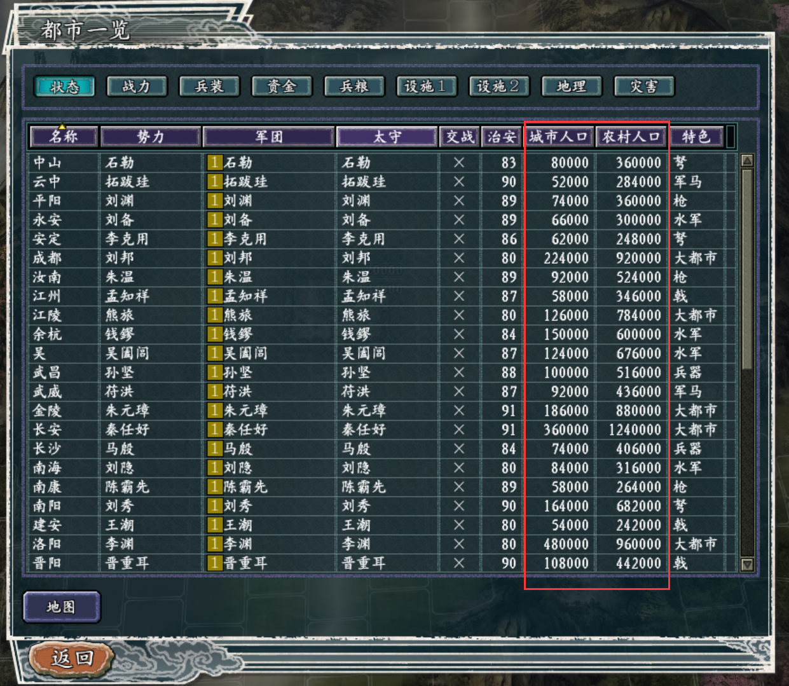

其中城市人口和农村人口是血色6.0新增的人口机制中的概念，城市和港关状态页均有这两列。


我们知道，311程序员在编程时肯定是将城市或港关定义成一个结构体的，其大小已经固定，每个城市或港关实例在内存中是以一段连续的内存表示的，这里就有个疑问，原版中城市是没有城市人口和农村人口之分的，那这里怎么能新增两个字段呢。

有两种可能，一种是城市人口和农村人口覆盖了原结构体中的无用或不常用属性，另一种就是原结构体本身就还留有未使用字段，可以用于拓展新属性。具体是哪种情况，我们进一步往下深挖。


有一点需要注意的是，这次我们不能再用 IDA Pro 分析游戏目录下的脱壳文件 san11pk.exe 了，因为我们玩的血色衣冠是 sire 在 san11pk.exe 做了一些内存修改（或者说补丁）的，我们并不清楚 sire 到底修改了啥，因此要分析也得是分析运行的 san11pk.exe 的进程的内存。

我们先打开sire，为了验证我们分析的内存是加了 sire 补丁后的，我们在 sire 里加载一下我们上面编写的显示五维和的包，然后用 sire 启动游戏。

再打开32位版的 IDA Pro，点 Debugger -> 选 Local Window Debugger，找到san11pk.exe对应的进程，选择，这样就用 IDA Pro 打开了这个进程的内存了，里面不仅有 san11pk.exe 的内容，还有其调用的链接库的内容。我们跳到 **009501E0**，可以找到我们计算五维和的函数代码：

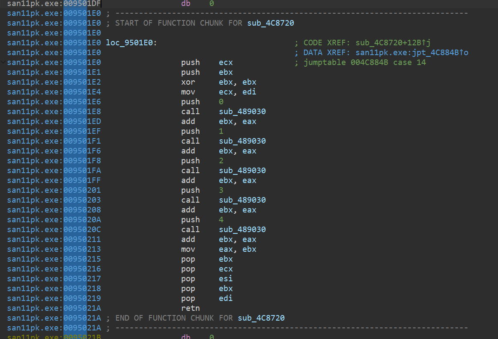

说明我们现在看到的内容就是加了sire补丁后的 san11pk.exe。


需要注意的是，这里的 IDA debugger 是 attach 在进程上的，可以看到里面除了有san11pk.exe 的 segment，还有其他各种引入的动态库（dll）的 segment，如果我们将内存快照存下来分析，会发现 idb 文件超大， IDA Pro 分析时连 dll 里的内容也会分析，复杂度提升到根本分析不完的程度。【PS：这是我踩的第一个坑】

没有 IDA Pro 的分析帮助，怎么看得懂 RK 大佬们的代码呢。所谓 “**工欲善其事，必先利其器**”，为此我在网上各种搜索查找资料，加上自己不断摸索，终于找到了正确的道路：

我们的需求其实很简单，就是**将 sire 修改后的 san11pk 内存存下来供我们后续分析**，我们观察 IDA Pro 里呈现的 san11 进程，发现 san11pk.exe 的内存范围是 **00400000** -> **09C8256C**，和原来分析 san11pk.exe 那个可执行文件是一样的，我们要做的就是将 内存范围是 **00400000** -> **09C8256C**的 segment存下来，为此我写了个 IDAPython 脚本实现这个功能：

```python
import os

import idaapi
import idautils
import idc


def save_memory_range(start_addr, end_addr, output_file):
    with open(output_file, "wb") as f:
        current_addr = start_addr
        while current_addr <= end_addr:
            # Read 0x1000 bytes at a time
            chunk_size = min(0x1000, end_addr - current_addr + 1)
            data = idaapi.get_bytes(current_addr, chunk_size)
            if data:
                f.write(data)
            current_addr += chunk_size


# Define the memory range you want to save
start_address = 0x00400000
end_address = 0x09C8256C

# Specify the output file path
output_filename = "san11pk_dump.exe"

# 存到桌面
output_filename = os.path.join(os.path.expanduser("~"), "Desktop", output_filename)
print(f"Saving memory range from {hex(start_address)} to {hex(end_address)} to {output_filename}")


# Save the memory range to the specified file
save_memory_range(start_address, end_address, output_filename)


print(f"Memory range from {hex(start_address)} to {hex(end_address)} saved to {output_filename}")

```

将脚本存为 [ida-scripts/save_san11pk.py](../ida-scripts/san11pk_dump.py)，然后在 IDA Pro 中 File -> Script File 执行该脚本，即可将内存范围是 **00400000** -> **09C8256C**的 segment 存下来，存到桌面的 san11pk_dump.exe 文件中。

我们将`san11pk_dump.exe`移至原 `san11pk.exe`的目录下，然后再用 IDA Pro打开这个 exe，就会自动进行分析了，并且速度很快，结果也更准确。

至此第一步算是完成，这也为后面进一步分析代码奠定基础。


### 第二步：使用 CE 分析获取城市/农村人口相关数据和函数的地址

接下来我们要找到调用获取城市的城市人口和农村人口的函数。


下面我们又得引入另一个重量级工具——**CheatEngine**了，这个工具可以捕捉运行时程序的内存信息。

打开32位的CE，选择打开san11pk血色衣冠的进程，接下来我们选个城市人口数字（如成都城市人口数 224000），填入CE，如下图：

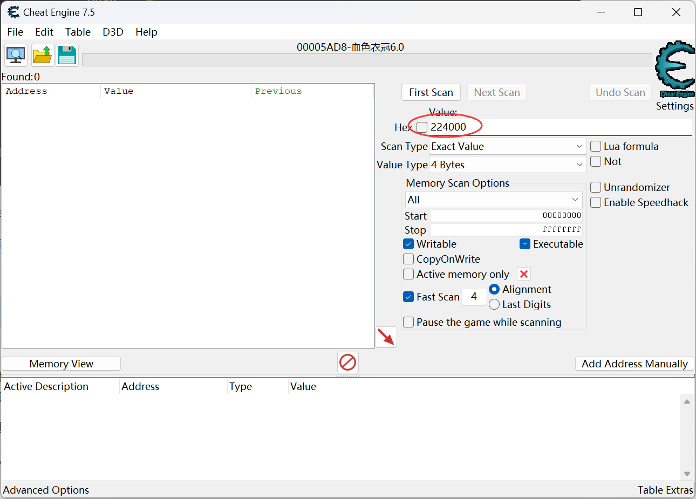

再点 FirstScan，发现了恰好一处地址 **6E07474** 的值为 224000：

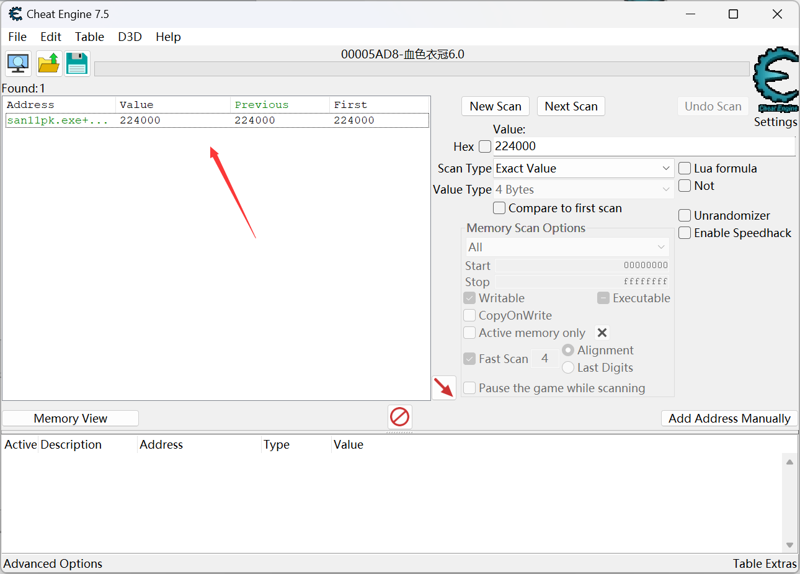

这个地址附近肯定就是存成都这个城市结构体的内存区域了，我们右键该项，选 Find out what accesses this address，这时会提示你 attach debugger到该进程，选是，我们再进游戏随便操作几下（如打开都市一览），然后发现有两处使用了该地址：

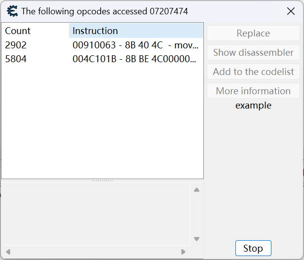

至此我们便找到了城市人口相关的数据和函数地址，农村人口的类似可得。


### 第三步：分析城市/农村人口相关代码


现在得到了使用城市信息的函数的地址，我们可以继续在CE中探索代码，也可以回到 IDA 中，这个看个人习惯，像RK那些大佬，对汇编比较熟悉，都是直接在 CE 中读代码和改代码，我水平有限，还是回到 IDA 中来分析代码吧，一是 IDA 跳转比较方便，二是 IDA 会做一些分析辅助，区分哪些地方是函数，哪些地方是数据，对我们新手还是比较友好的。


我们先分析**004C101B**处的函数：

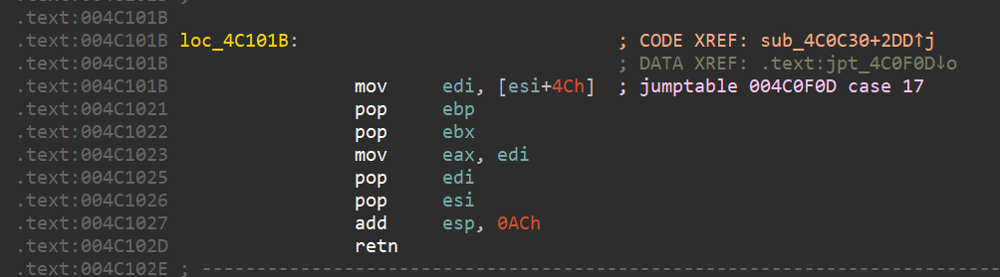

看注释可以得到，1. 该指令的函数起点是**004C0C30**；2. 这个指令地址存在被**004C1620**跳表引用；

我们先看跳表被引用的地方**004C0F0D**：

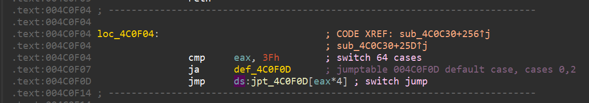

再看该跳表存储的内容的地方**004C1620**：

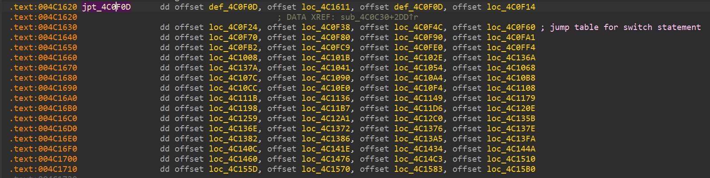

发现命令编号是直接就是跳表序号，没有再套一层，上述获取城市人口数的loc **4C101B**，在跳表中的序号为 17（11h），

查内存资料，发现这个函数原来是取城市方针这个属性的

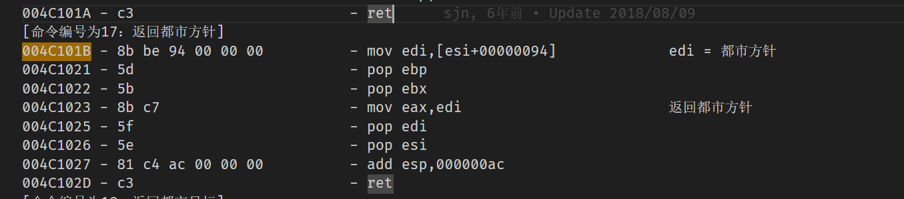

估计你也和我一样，不知道城市方针是个什么东西，应该是什么不太重要的属性，所以大胆猜测，rk 就是用城市人口数覆盖了城市方针这个属性的。


上面CE显示的结果还有一个信息是，城市人口一直在 **910063** 处被取用，该位置所属函数为**910030**，一般这个位置的函数肯定是自定义的函数了，我们可以看看这个函数是干什么的：

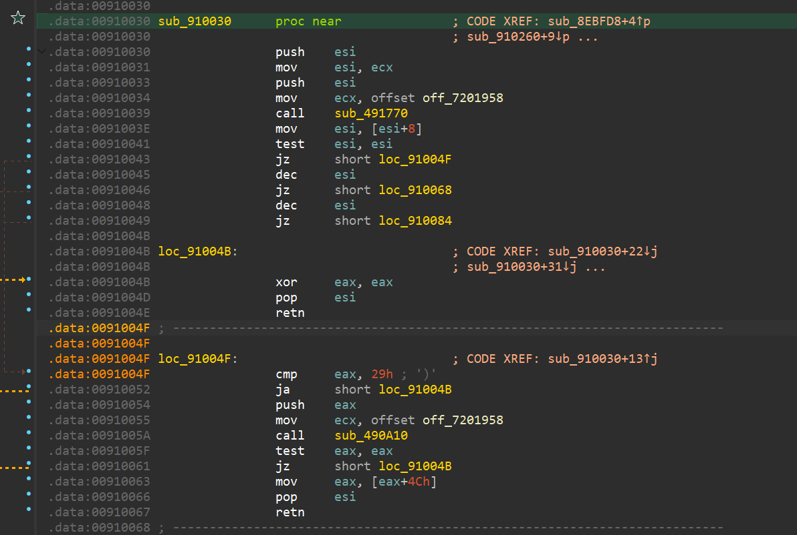

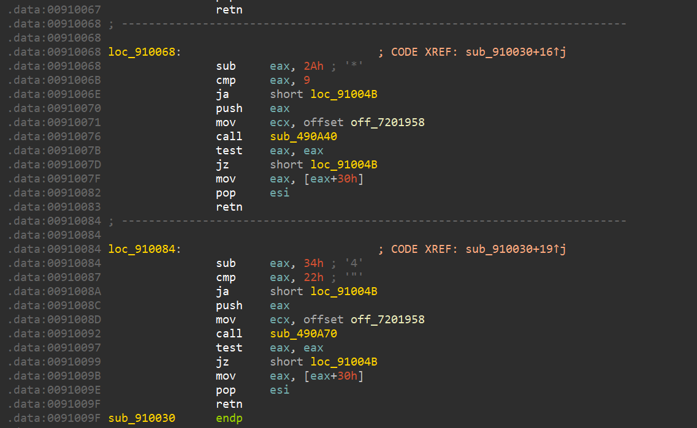

查内存资料，可知上述调用的几个函数分别为：

- 00491770 根据设施指针获取设施ID
- 00490a10 根据城市ID获取城市指针
- 00490a40 根据关隘ID获取关隘指针
- 00490a70 根据港口ID获取港口指针

根据910063那段，可以肯定这里是获取城市或港关的城市人口的函数，至于怎么获取，对于城市来说，取的是[城市指针+4Ch], 而对于港/关，取的是[港/关指针+30h]


类似地，我们也可以分析到农村人口函数地址是 **4C102E**， 覆盖的是城市目标，农村人口数在 **009100DB** 处被取用，该位置所在函数为**009100A8**，为获取城市或港关的农村人口的函数。


关于城市人口和农村人口的相关代码先分析到这，我们如果想在都市一览和港关一览的状态页增加一列，就必须找到其对应的数组在哪，首先想到的是，这个数组可能和之前显示武将一览的数组放在一起，比如武将能力页的记录数组的地址在 **008BD460**，附近基本全是类似的数组，

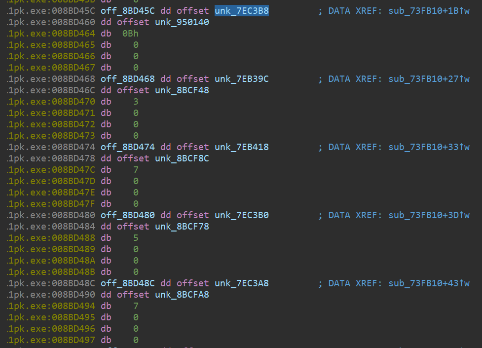

但是数组太多，如果一个个验证非常低效。

我们观察到, 与之前分析 san11pk.exe 文件的结果不同，这次分析的是运行时的进程，每个数组的上面都有个 dd offset，指向一个字符串，比如这里能力页数组上面的的 unk_**7EC3B8**处的值就表示的是“能力”：

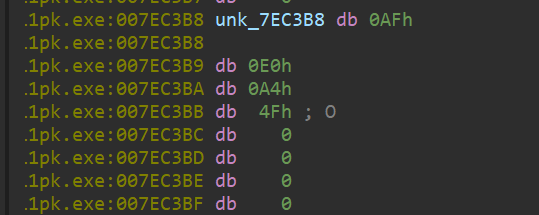

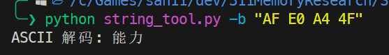

由此我们可以推断，这块内存记录了该页名称和对应列的数组。

我们以此为切入点，寻找都市一览特殊的页，比如“地理”，big5码为“A6 61 B2 7A”，我们在 IDA Pro 中按`Alt+B`查找该字节数组：

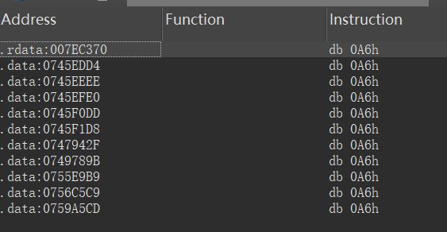

逐个查看，发现就第一个为页面里的列标题文字，位于**007EC370**，查询引用该字符串的地方，找到都市地理页的数组位于**008BC20C**，

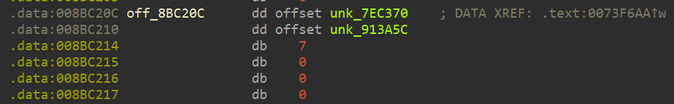

于是顺腾摸瓜便可找到都市状态页的数组位于**008BC1BC**：

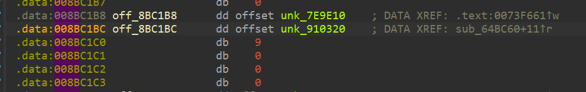

其内容为：

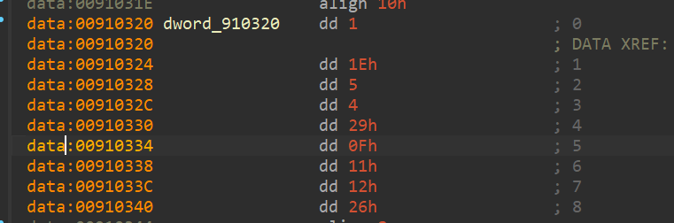

从这我们可以看出，取都市的城市人口和农村人口的命令编号分别诶 11h，12h，对应的函数分别为 loc_4C101B 和 loc_4C102E，与上面的测试结果一致。


### 第四步：分析科技点相关代码

我们知道科技点收入和人口有关，上面 CE 显示还有一处`910063`调用了城市人口, 在 IDA 对该段代码分析可以得知这是一个获取城港关城市人口的函数（图示为已经分析好的代码）

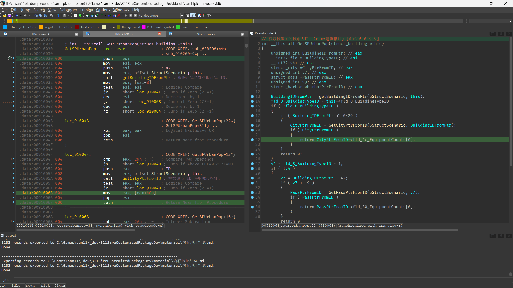

鼠标点 `GetSPUrbanPop` 再按`x`键可以查看有哪些函数调用了 `GetSPUrbanPop` 

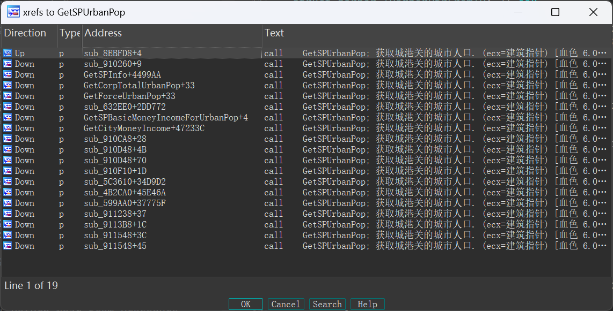


### 第五步：编写显示科技点收入的自定义包

接下来我们开始编写自定义包。


首先，我们需要找一块内存，用于我们新增修改，利用工具篇中介绍的 [analyze_scp](#批量分析各自定义包新增的修改地址区间)脚本，我们找到一块还未被大佬们涉足的内存，经过分析我们选定 **00970020** 作为我们的起始地址


目前找到的不太明白其功能的城市命令编号：

10h：城市是否处于战斗不可状态 （值取的 [esi+90h] ）


