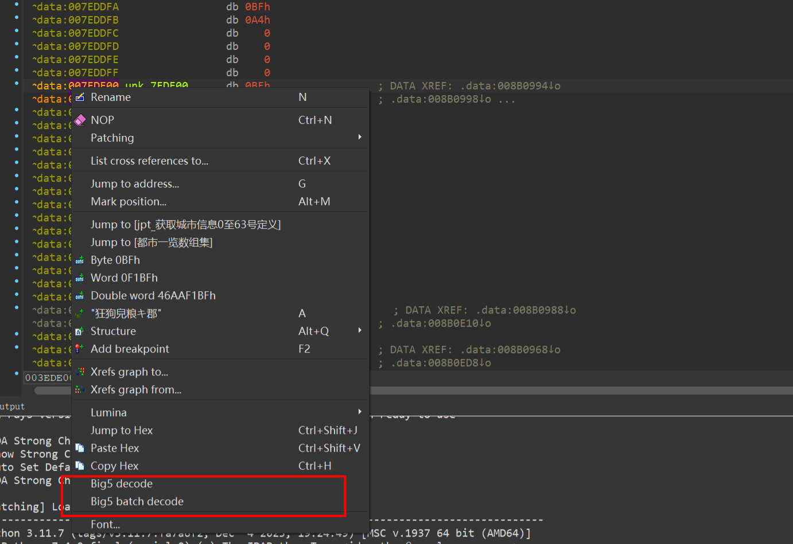
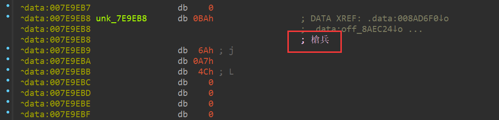
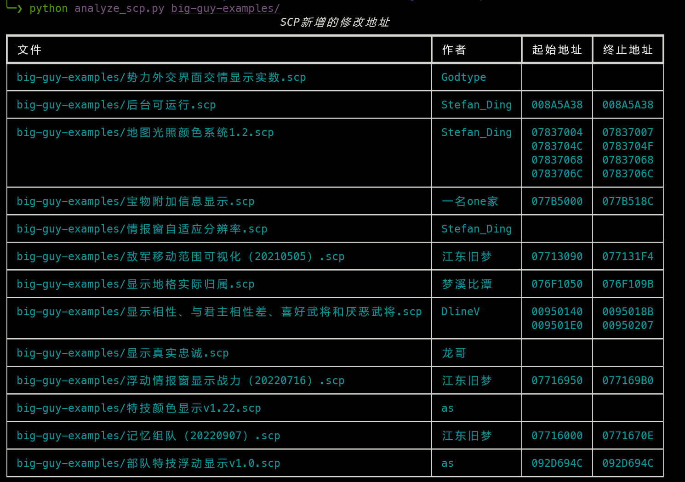
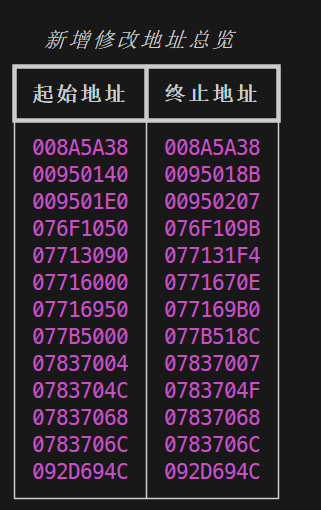

## 工具篇

### big5-decode：批量在 IDA Pro 中识别所有字符串并添加中文注释

游戏中的字符串都是以 big5 格式编码，在 IDA 浏览代码时，遇到一个便用工具解码一下，然后再添加 repeatable 注释，效率非常低，了解到 IDA 支持用 python 编写插件后，做了一个 [big5-decode-ida](https://github.com/sean2077/big5-decode-ida) 插件，以实现该功能：

按说明安装插件后，重启 IDA Pro，在 IDA 视图下右键某个地址，会多两个选项：

点 Big5 decode 后便可自动解码+注释：

Big5 batch decode 则是批量解码+注释，输入终止地址后，便可在所在地址和终止地址之间重复执行解码+注释，这样便可将所有字符串都解析出来，效率简直起飞！

### 批量更新 IDA 中的结构体声明

IDA 脚本： SireCustomizedPackageDev\ida-scripts\ida_structs\update_ida_struct.py

更新该脚本同目录下描述结构体的 txt 文件后，便可通过该脚本批量更新或创建 IDA Structure。

### 批量分析各结构体内存分布

脚本： SireCustomizedPackageDev\ida-scripts\ida_structs\analyze_structs.py

### 批量分析各自定义包新增的修改地址区间

为快速了解其他开发者在san11pk内存中哪些块已经被引用，开发了一个脚本 [analyze_scp.py](./analyze_scp.py)，用于批量分析所有 scp 文件，找到所有修改的地址区间，方便后续分析。

### 分析san11pk未使用的内存区间

Ghidra 脚本：SireCustomizedPackageDev\ghidra-scripts\find_unused_memory_blocks.py

